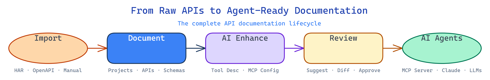
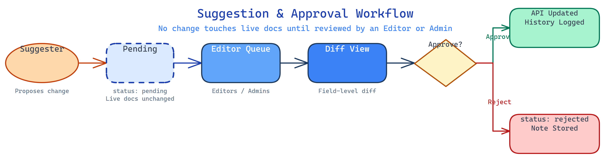

# API Platform

> The documentation layer your APIs need for the age of AI agents.

---

## The Problem Nobody Has Solved Yet

Every engineering team documents APIs. But the way we document them was designed for humans reading a browser — not for AI agents consuming a tool registry.

Today, teams are stuck with three bad options:

**Option 1 — Swagger / OpenAPI specs**
Great for schema contracts. Terrible for telling an AI *what this API does, when to use it, and what to watch out for*. An OpenAPI spec describes the shape of a request. It does not explain intent, business context, or operational nuance. An LLM calling your API cold from a spec will hallucinate usage patterns and misfire on edge cases.

**Option 2 — Postman / Insomnia collections**
Built for individual developers testing endpoints. No team-wide knowledge layer. No natural language descriptions. No semantic search. No role-based collaboration. A shared collection is a snapshot of requests, not a source of truth about what your APIs mean.

**Option 3 — Confluence / Notion / internal wikis**
Unstructured prose that ages immediately. No schema validation. No connection to the actual API contract. Nothing machine-readable. The moment a team writes "see the API docs for the full schema," the wiki becomes a pointer to somewhere else rather than the answer itself.

None of these were built for a world where AI agents are calling your APIs autonomously, where MCP (Model Context Protocol) tool registries need precise, curated descriptions, and where the quality of your natural language documentation directly determines whether your agent does the right thing or the wrong thing.

---

## What This Platform Does Differently

API Platform is built from the ground up around a single insight: **the most valuable documentation asset is no longer a schema — it is a semantic description that an LLM can reason about.**



### 1. LLM-First Tool Descriptions

Every API entry carries a `tool_description` — a curated, natural language paragraph that describes what the endpoint does, when to use it, and what behaviours to be aware of. This is the field that gets injected into an agent's context window. It is first-class, not an afterthought.

When you connect your API documentation to an AI agent or MCP server, the agent does not receive a JSON schema dump. It receives a precise, human-reviewed description written for the context window.

### 2. Built-In MCP Config Generation

Model Context Protocol is how leading AI platforms (Claude, OpenAI, and others) expose tools to agents. Each API entry in this platform maintains a ready-to-use MCP tool config — `name`, `description`, `inputSchema` — that can be copied directly into any MCP server implementation.

No manual translation from API spec to MCP tool. No drift between what the API does and what the tool config says. One source of truth, always in sync.

### 3. The Semantic Layer for Agent Development

Think of this platform as the **semantic layer** between your raw API infrastructure and the AI agents that consume it — exactly as a semantic layer in a data warehouse sits between raw tables and business intelligence tools.

A data warehouse without a semantic layer forces every analyst to rediscover join logic, metric definitions, and business rules from scratch. An API surface without a semantic layer forces every agent developer to rediscover what each endpoint means, what its inputs represent, and when not to call it.

This platform is that layer. It stores:
- What each API does in human and machine-readable terms
- The request and response contracts
- Operational notes (rate limits, auth requirements, known edge cases)
- The MCP tool configuration, ready for agent frameworks

The result is **faster agent development**. When a developer builds a new agent that touches your APIs, they start from a curated, trusted knowledge base — not raw schema files or stale documentation pages. Onboarding a new agent to a 50-endpoint surface goes from days of reverse-engineering to hours of configuration.

### 4. Works Across Any Data Source

This platform documents APIs that talk to any backend: REST services, database APIs, data warehouse query endpoints (Snowflake, BigQuery, Redshift), internal microservices, third-party integrations. If it has an HTTP interface, it belongs here.

For teams building AI agents over data infrastructure — where agents query warehouses, trigger pipelines, and read from operational databases — this is the single place to maintain the natural language contract that makes those agents reliable and auditable.

### 5. Import from What You Already Have

Teams do not start from a blank slate. The platform ingests:

- **OpenAPI / Swagger specs** (3.0 and 2.0 JSON) — parse an existing spec and bulk-import all endpoints in one action, with schema and description extraction automatic
- **HAR files from browser DevTools** — capture live API traffic and import real endpoints with inferred schemas, path normalisation, and deduplication built in

The import pipeline turns a legacy Swagger file or a recorded network session into a structured, AI-ready documentation layer within minutes.

### 6. AI-Assisted Documentation

The AI Generate feature calls Claude to draft `tool_description` and `mcp_config` for any API entry based on its name, method, endpoint, and schemas. Human review happens before anything is saved. The workflow is: AI drafts → editor reviews → save. This is not auto-generation with no oversight — it is a quality multiplier that eliminates the blank-page problem.

Semantic Search lets any team member find APIs using natural language ("find endpoints that handle user authentication" or "which APIs write to the orders table?"). The search does not match on field names — it reasons over the documented intent of each endpoint.

### 7. Structured Collaboration, Not a Free-for-All

API documentation is a shared asset. Changes need review. Not everyone should be able to edit production docs directly.

The platform has a four-role permission model (Viewer, Suggester, Editor, Admin) with a suggestion and approval workflow:
- **Suggesters** (technical writers, PMs, QA) propose changes without touching live docs
- **Editors** (senior engineers, tech leads) review field-level diffs and approve or reject with notes
- **Admins** manage team membership and roles



Every change — direct or approved suggestion — is recorded in an append-only audit trail tied to each API entry. You can see exactly who changed what, when, and why.

---

## Why Now

Three forces are converging:

**AI agents are becoming production infrastructure.** Teams are deploying agents that call internal APIs autonomously. The quality of the documentation those agents receive determines whether they behave correctly or cause incidents.

**MCP is becoming the standard tool protocol.** Major AI platforms have standardised on MCP for tool use. Every MCP implementation needs a `name`, a `description`, and an `inputSchema` per tool. Without a system to maintain those descriptions at scale, teams copy-paste configs from Slack threads and README files.

**Data infrastructure is becoming AI-queryable.** Warehouses like Snowflake and BigQuery now expose SQL interfaces that agents can call. The semantic layer problem — defining what data means, not just where it lives — is now an API documentation problem.

This platform addresses all three at the intersection.

---

## How It Compares

| | API Platform | Swagger UI | Postman | Confluence |
|---|---|---|---|---|
| LLM-optimised tool descriptions | ✓ | — | — | — |
| MCP config generation + storage | ✓ | — | — | — |
| Semantic / natural language search | ✓ | — | — | Partial |
| AI-assisted documentation drafting | ✓ | — | — | — |
| Role-based suggestion + approval workflow | ✓ | — | — | Partial |
| Full audit trail per API entry | ✓ | — | — | Partial |
| OpenAPI + HAR import | ✓ | Read-only | ✓ | — |
| Built for agent / MCP development | ✓ | — | — | — |
| Works across DB, warehouse, and service APIs | ✓ | — | Partial | ✓ |

---

## Current State

Phases 1–4 are fully built and test-covered (311 automated tests). The platform is ready to connect to a Supabase backend and deploy to Vercel.

| Phase | What was built |
|---|---|
| Phase 1 | Projects, API entries, full CRUD, sidebar with filters, all detail tabs |
| Phase 2 | OpenAPI + HAR import, AI Generate, semantic search |
| Phase 3 | Role-based access, suggestion workflow, diff view, approve/reject/withdraw, user management |
| Phase 4 | History system, audit trail per API, action-level color coding |

**Pending before first production deployment** (see `docs/setup.md` for full detail):
- Three database migration files (`suggestions` and `history_events` tables, role-scoped RLS policies, Postgres audit trigger)
- Two page routes to wire up (`/suggestions` panel, `/settings/users` management)

---

## Tech Stack

Next.js 14 · TypeScript · Supabase (Postgres + Auth + Realtime) · Anthropic SDK (Claude) · Tailwind CSS · Zustand · Vitest

---

## Getting Started

See [`docs/setup.md`](docs/setup.md) for the full setup guide including environment variables, database migrations, and first-user configuration.

```bash
npm install
cp .env.local.example .env.local   # fill in Supabase + Anthropic keys
npm run dev
```

```bash
npm run test:run   # 311 tests, no external dependencies required
```
